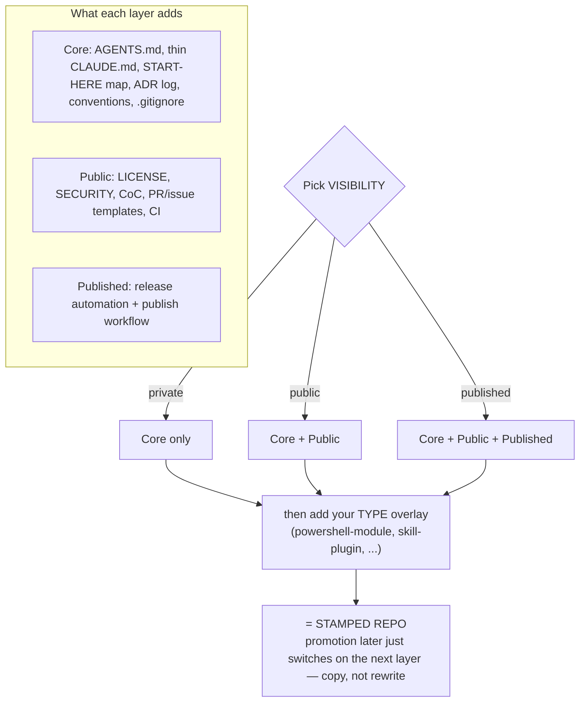
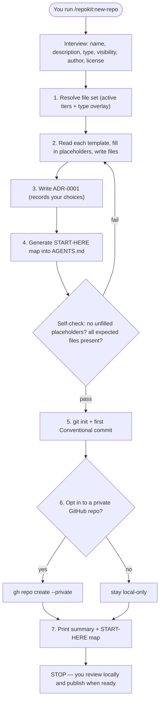
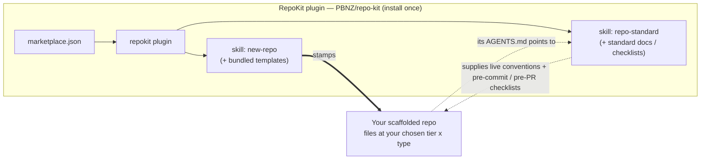

# RepoKit

**One reusable repo standard + a `/new-repo` scaffolder, packaged as a Claude Code plugin.**

Every repo you build with an agent tends to reinvent its own rules — what to read first, the
coding style, the pre-commit/PR steps, the commit format, where learnings live. RepoKit fixes
that: it stamps a consistent, navigable repository from commit #1, organised by **type × tier**,
so a forever-private script bin stays effortless and a published module gets the full governance —
from the *same* standard.

## The idea in one picture — type × tier

Every repo gets a light **Core** baseline. **Visibility** decides how many layers switch on;
**type** adds its own structure-specific files on top. Promotion (private → public → published)
just switches on the next layer — a copy, not a rewrite.



## What `/repokit:new-repo` does

It interviews you, stamps the right files for your chosen type × tier, checks its own work, makes
the first commit — then **stops** so you review and publish when you're ready.



## How the pieces fit

RepoKit is one plugin you install once. It carries two skills: **new-repo** *makes* a repo;
**repo-standard** *guides you while you work in* any repo it made.



## Install

```text
/plugin marketplace add PBNZ/repo-kit
/plugin install repokit@repo-kit
/reload-plugins
```

Then scaffold a repo:

```text
/repokit:new-repo my-new-repo "One-line description of what it does"
```

It will interview you for the type and visibility if you don't give them, stamp the files, and
make the first commit. Nothing is pushed or published — you do that when you're ready.

## Profiles

- **Type — what the repo *is*:** `powershell-module` (built out), plus `skill-plugin`,
  `collection`, `mcp-server`, `app-ts`, `app-python`, `script-collection` (stubs, filled as needed).
- **Tier — ceremony, set by visibility:** **Core** (every repo), **+Public**, **+Published**.

See [`the standard`](plugins/repokit/skills/repo-standard/standard/the-standard.md) for the full
model, the per-tier file lists, and the where-things-live map.

## Repository layout

This repo dogfoods its own standard. See [`AGENTS.md`](AGENTS.md) for the START-HERE map.

## Contributing & licence

- Contributions: see [`CONTRIBUTING.md`](CONTRIBUTING.md).
- Security: see [`SECURITY.md`](SECURITY.md).
- Licence: [Apache-2.0](LICENSE).
