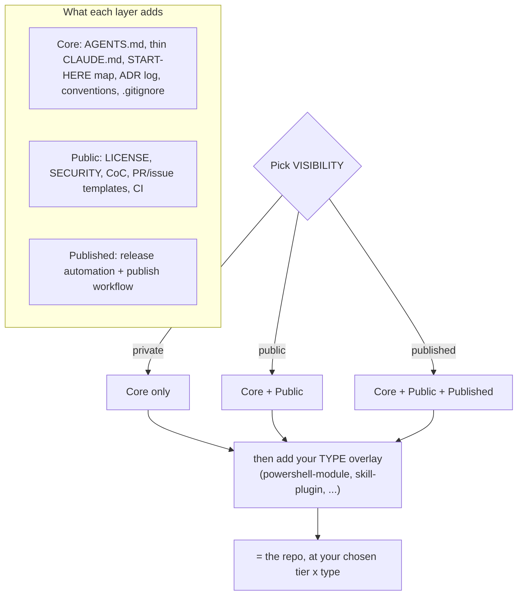

# The RepoKit standard

One standard, applied at the right **tier**. A repo's profile has two independent dimensions:
**type** (what it is) and **tier** (ceremony, set by visibility). Private repos stay light; public
and published ones get more governance — from the same structure.

## Tiers (cumulative, by visibility)

### Core — every repo, public *or* private

- `AGENTS.md` (canonical agent file) + thin `CLAUDE.md` (`@AGENTS.md`).
- A **START-HERE map** in `AGENTS.md` — where rules, decisions, checklists, CI, and tests live.
- `doc/adr/` — the learnings log (ADRs). `0000-template.md` is the template.
- `README.md`, `CONTRIBUTING.md` (internal "where things live"), `CHANGELOG.md`.
- `.gitignore`, `.editorconfig`, `.gitattributes`.
- Conventional Commits; the `repo-standard` skill applies the conventions and checklists.

No governance overhead. A forever-private repo stays here and stays effortless.

### +Public — when the repo goes public

- `LICENSE`, `SECURITY.md`, `CODE_OF_CONDUCT.md`, an external `CONTRIBUTING.md`.
- `.github/` PR + issue templates.
- CI (`.github/workflows/`).

### +Published — when the repo ships to a registry

- Release automation + a publish workflow **appropriate to the target registry**.
- For registries with an annotatable version line (e.g. a PowerShell `.psd1`, npm `package.json`):
  `release-please` config + a publish workflow gated behind an approval environment.
- For a **marketplace-only plugin** (the registry *is* the git repo): "publish" = bump versions +
  tag + push. Release automation is optional here — see *Publish profiles* below.

## Types (what the repo is)

| Type | Adds |
|------|------|
| `powershell-module` | `.psd1` manifest, `.psm1` root module, `Public/` + `Private/`, `Tests/` (Pester); PSScriptAnalyzer + Pester CI; `Publish-PSResource` publish (Published) |
| `skill-plugin` | a Claude Code plugin: `.claude-plugin/`, `skills/<skill>/SKILL.md`, validation *(stub — fill when first needed)* |
| `collection` | a multi-component repo with a top-level map + per-component subdirs *(stub)* |
| `mcp-server` | an MCP server *(stub)* |
| `app-ts` / `app-python` | an application *(stub)* |
| `script-collection` | a loose collection of scripts *(stub)* |

## Where things live (the convention)

- **Rules / orientation** → `AGENTS.md` (+ thin `CLAUDE.md`). Read the START-HERE map first.
- **Decisions & rationale** → `doc/adr/`.
- **Conventions & checklists** → the `repo-standard` skill (this one).
- **CI / release / publish** → `.github/workflows/`.
- **Tests** → the type's test dir (e.g. `Tests/` for a PowerShell module).

## Promotion path

Private → public → published just **switches on the next layer** over the *same* structure. Moving
a script from a private collection into a public collection repo is a **copy, not a rewrite**.

## Publish profiles

- **Registry-backed** (PSGallery, npm): `release-please` bumps the version (via a version-line
  annotation), opens a release PR you approve, tags, and the publish workflow uploads behind a
  gated approval environment.
- **Marketplace-only plugin** (distributed *as* a git repo, e.g. a Claude Code plugin): there is no
  upload step — "publish" is bumping `plugin.json` / `marketplace.json` / `CHANGELOG.md`, tagging,
  and pushing. `release-please` is optional (it can't cleanly annotate the JSON manifests). RepoKit
  itself uses this profile.

## Do / don't

- **Do** author `AGENTS.md` and a thin `CLAUDE.md` that imports it.
- **Don't** put conventions in a plugin-root `CLAUDE.md` — Claude Code does not load it as context.
- **Do** keep private repos at Core. **Don't** force public/published governance onto them.
- **Do** record notable decisions as ADRs. **Don't** rely on commit messages alone for rationale.
- **Do** keep `SKILL.md` files and templates as plain prose — no secrets, no email addresses.
