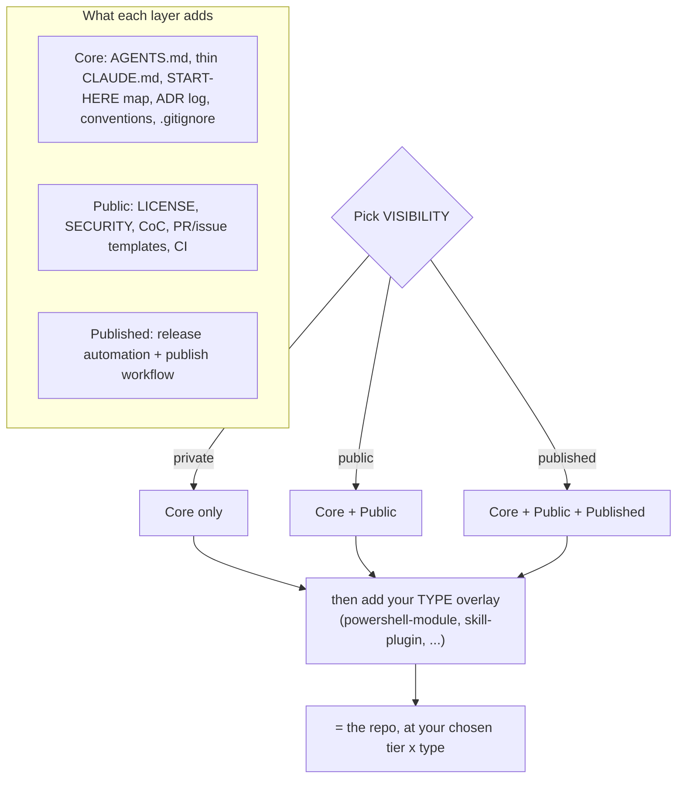

# The RepoKit standard

One standard, applied at the right **tier**. A repo's profile has two independent dimensions:
**type** (what it is) and **tier** (ceremony, set by visibility). Private repos stay light; public
and published ones get more governance — from the same structure.



## Tiers (cumulative, by visibility)

### Core — every repo, public *or* private

- `AGENTS.md` (canonical agent file) + thin `CLAUDE.md` (`@AGENTS.md`).
- A **START-HERE map** in `AGENTS.md` — where rules, decisions, checklists, CI, and tests live.
- `docs/` — all documentation, including `docs/adr/` (the ADR learnings log; `0000-template.md`
  is the template).
- A **resume-state artifact** — `docs/CHECKPOINT.md` by default, or a declared substitute (a
  living-docs `docs/STATE.json`, a README-status contract) — with a row in the START-HERE map.
  See *Resume state* below.
- `README.md`, `CONTRIBUTING.md` (internal "where things live"), `CHANGELOG.md`.
- `.gitignore`, `.editorconfig`, `.gitattributes`.
- Conventional Commits; the `repo-standard` skill applies the conventions and checklists.

No governance overhead. A forever-private repo stays here and stays effortless.

### +Public — when the repo goes public

- `LICENSE`, `SECURITY.md`, `CODE_OF_CONDUCT.md`, an external `CONTRIBUTING.md`.
- `.github/` PR + issue templates.
- CI (`.github/workflows/`).

### +Published — when the repo ships to a registry

- Release automation + a publish workflow **appropriate to the target registry**.
- For registries with an annotatable version line (e.g. a PowerShell `.psd1`, npm `package.json`):
  `release-please` config + a publish workflow gated behind an approval environment.
- For a **marketplace-only plugin** (the registry *is* the git repo): "publish" = bump versions +
  tag + push. Release automation is optional here — see *Publish profiles* below.

## Types (what the repo is)

| Type | Adds |
|------|------|
| `powershell-module` | `.psd1` manifest, `.psm1` root module, `Public/` + `Private/`, `Tests/` (Pester); PSScriptAnalyzer + Pester CI; `Publish-PSResource` publish (Published) |
| `docker-compose` | `compose.yaml` (no `version:`; named volumes for data, commented config/build patterns), `.env.example`, `.dockerignore`; `docker compose config -q` validation CI (Public). Config committed, data in named volumes, secrets in `.env` |
| `power-platform-connectors` | a committed Postman collection → **OpenAPI 2.0** custom-connector definitions for Microsoft Power Platform. A pinned-Docker generator (`postman-to-openapi` + `api-spec-converter`) converts + normalises to valid Swagger 2.0, splitting per top-level folder **only when a single def would hit the 1 MB limit**; self-validates; a scheduled sync workflow PRs upstream changes. Builds with just Docker — no Postman account (Public) |
| `skill-plugin` | a Claude Code plugin: `.claude-plugin/`, `skills/<skill>/SKILL.md`, validation *(stub — fill when first needed)* |
| `collection` | a multi-component repo with a top-level map + per-component subdirs *(stub)*. Its **fleet-hub profile** — a docs-only collection acting as a multi-repo router — is defined in [`fleet.md`](fleet.md) |
| `mcp-server` | an MCP server *(stub)* |
| `app-ts` / `app-python` | an application *(stub)* |
| `script-collection` | a loose collection of scripts *(stub)* |

## Where things live (the convention)

- **Rules / orientation** → `AGENTS.md` (+ thin `CLAUDE.md`). Read the START-HERE map first.
- **Decisions & rationale** → `docs/adr/`.
- **Conventions & checklists** → the `repo-standard` skill (this one).
- **CI / release / publish** → `.github/workflows/`.
- **Tests** → the type's test dir (e.g. `Tests/` for a PowerShell module).

For a fuller "I have X — where does it go, and how do I create the place if it's missing" guide,
see [`where-things-go.md`](where-things-go.md).

### Growing the `docs/` folder

Core ships only `docs/adr/`. Add more under the same `docs/` umbrella **as you need it** — don't
pre-create empty directories. When the docs grow substantial, a proven split is
[Diátaxis](https://diataxis.fr/): `docs/tutorials/`, `docs/how-to/`, `docs/reference/`,
`docs/explanation/`, plus a `docs/README.md` index and `docs/assets/` for images. Adopt it when
you have docs to organise, not before.

### Living docs (opt-in add-on)

If the repo's docs track **live operational state** (deployed resources, running jobs, milestone
status), adopt the **living-docs add-on**: volatile shared facts live once in `docs/STATE.json`,
README/runbook render them via marker blocks, and `scripts/check-docs.ps1` (+ a `docs.yml`
workflow) enforces consistency deterministically. `/new-repo` offers it at scaffold time; see
[`living-docs.md`](living-docs.md) for the pattern and the adopt-in-an-existing-repo recipe, and
[`doc-style.md`](doc-style.md) for the formatting rules every repo's docs should follow.

## Resume state (required at Core)

The doc that decays first is the one a fresh session needs first: "where was this repo left, and
what's the exact next step?" So Core **requires** a resume-state artifact, and the START-HERE map
**must** have a row pointing at it. The default is `docs/CHECKPOINT.md` (scaffolded by
`/new-repo`); a living-docs `docs/STATE.json` or a README-status contract are fine substitutes
**when declared** in the map (see *Variance declarations*).

The artifact's contract, whatever its form:

- a **last-updated** date (`YYYY-MM-DD`), and
- an **explicit next step** — the exact next command or task, or `paused — nothing pending`.

The pre-commit checklist carries the tripwire ("resume-state updated, or this commit doesn't
change state — say which"). Optional CI nudge (warn, not fail — copy into any workflow):

```yaml
- name: Warn when the checkpoint goes stale
  shell: bash
  run: |
    n=$(git rev-list --count "$(git log -1 --format=%H -- docs/CHECKPOINT.md)..HEAD" 2>/dev/null || echo 0)
    if [ "$n" -gt 15 ]; then
      echo "::warning::docs/CHECKPOINT.md untouched for $n commits — is the resume state still true?"
    fi
```

## Naming conventions

RepoKit does **not** impose a single uniform casing. Each name follows the convention of the
ecosystem that owns it — **consistency with the world beats consistency within the repo**, because
many of these names are read by tools that require an exact case.

| What | Convention | Why |
|------|-----------|-----|
| Root meta-docs — `README.md`, `LICENSE`, `SECURITY.md`, `CODE_OF_CONDUCT.md`, `CONTRIBUTING.md`, `CHANGELOG.md`, `AGENTS.md`, `CLAUDE.md` | `UPPERCASE.md` | Near-universal OSS convention; GitHub special-cases them and Claude Code reads `CLAUDE.md` at that exact name. |
| PowerShell module dirs — `Public/`, `Private/`, `Tests/`, `Data/` | `PascalCase` | Microsoft-documented module layout; matches PowerShell's `Verb-Noun` PascalCase idiom. |
| PowerShell files — `<Module>.psd1`, `<Module>.psm1`, `<Module>.Tests.ps1` | `PascalCase`, base name == module name | Microsoft requirement: the manifest/root-module base name matches the module directory name. |
| GitHub plumbing — `.github/`, `.github/workflows/` | lowercase | Required by GitHub. |
| GitHub templates — `.github/ISSUE_TEMPLATE/`, `.github/PULL_REQUEST_TEMPLATE.md` | `UPPERCASE` dir/file; `lower_snake.md` for individual issue files (`bug_report.md`) | GitHub's documented convention. |
| Documentation — all under a single `docs/`; ADRs at `docs/adr/0001-title.md` | dir `docs/`; ADR files `lower-kebab` with a zero-padded numeric prefix | `docs/` is the dominant docs-dir convention; one umbrella avoids a confusing `doc/` + `docs/` split. |
| Tool config — `.gitignore`, `.editorconfig`, `.gitattributes`, `release-please-config.json`, `.release-please-manifest.json` | exact required name | Fixed by each tool. |
| Your own source files & dirs | the language's idiom | kebab-case (JS/TS), snake_case (Python), PascalCase (PowerShell/C#). |

**Rule of thumb:** if a tool or platform reads the name, match its required case exactly; otherwise
follow the language/ecosystem idiom; never rename a convention-bearing file just to make the tree
look uniform.

## Promotion path

Private → public → published just **switches on the next layer** over the *same* structure. Moving
a script from a private collection into a public collection repo is a **copy, not a rewrite**.

## Variance declarations

The standard tolerates variants by design — ceremony scales by tier, and a README-status
contract can genuinely beat a checkpoint file. What it does not tolerate is *silent* variance:

- **Any deviation from the tier's file set** — a substitute file, a relocated file, an omitted
  component — **must have a row in the START-HERE map** saying what replaces what (e.g.
  "Changelog → `docs/history/CHANGELOG.md`", "Resume state → README `## Status` contract").
- **Undeclared deviation is non-compliance. Declared deviation is a variant.** Every deviation
  in a compliant repo is visible from the START-HERE map alone — no archaeology.

**The self-check.** `scripts/repokit-check.ps1` (stamped by `/new-repo` at Core; retrofittable
by copying the file) verifies the declared structure actually exists, in seconds: canonical
agent file + thin shim present and the shim imports it, every START-HERE path resolves, and the
changelog / ADR dir / resume-state artifact exist at their declared (or default) locations. Run
it locally before a release, or add one CI line:

```yaml
- name: RepoKit self-check
  shell: pwsh
  run: ./scripts/repokit-check.ps1
```

**Adoption marker — retro-adopted repos.** A repo that adopts the standard mid-life snaps to the
conventions at the adoption commit; nothing before it should ever be re-flagged by an audit.
Declare the compliance horizon with one line in `AGENTS.md`, right under the START-HERE map:

```text
RepoKit adopted: 2026-07-19 (`<short-sha>`) — history before this commit predates the standard.
```

## Publish profiles

- **Registry-backed** (PSGallery, npm): `release-please` bumps the version (via a version-line
  annotation), opens a release PR you approve, tags, and the publish workflow uploads behind a
  gated approval environment.
- **Marketplace-only plugin** (distributed *as* a git repo, e.g. a Claude Code plugin): there is no
  upload step — "publish" is bumping `plugin.json` / `marketplace.json` / `CHANGELOG.md`, tagging,
  and pushing. `release-please` is optional (it can't cleanly annotate the JSON manifests). RepoKit
  itself uses this profile.

## Do / don't

- **Do** author `AGENTS.md` and a thin `CLAUDE.md` that imports it.
- **Don't** put conventions in a plugin-root `CLAUDE.md` — Claude Code does not load it as context.
- **Do** keep private repos at Core. **Don't** force public/published governance onto them.
- **Do** record notable decisions as ADRs. **Don't** rely on commit messages alone for rationale.
- **Do** keep `SKILL.md` files and templates as plain prose — no secrets, no email addresses.
- **Do** delete superseded doc content — git keeps the history. **Don't** keep "superseded by v2"
  annotations or before/after duplicates in living docs (see `living-docs.md`).
